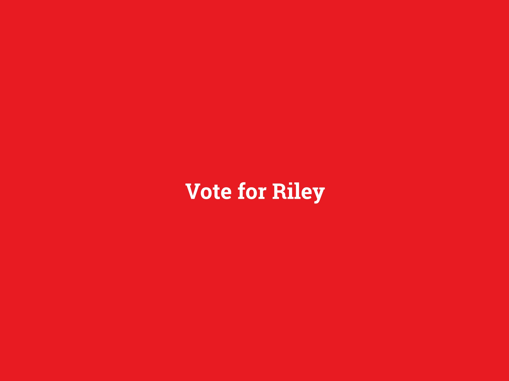
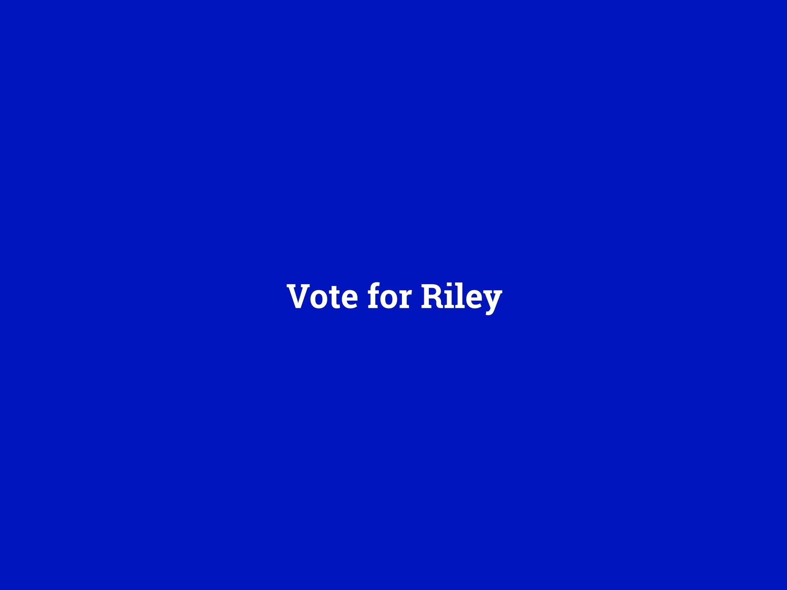
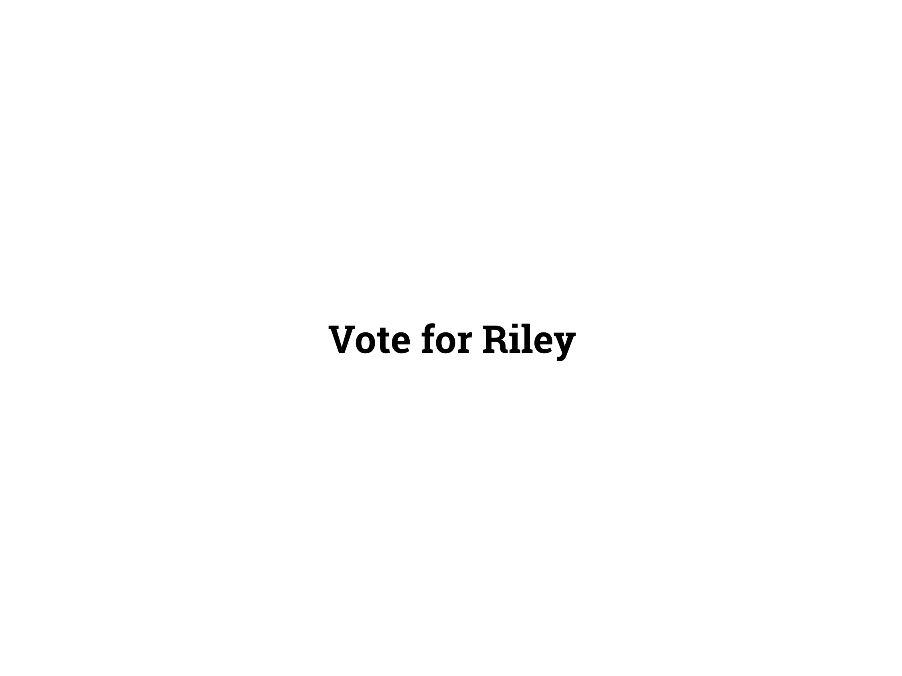
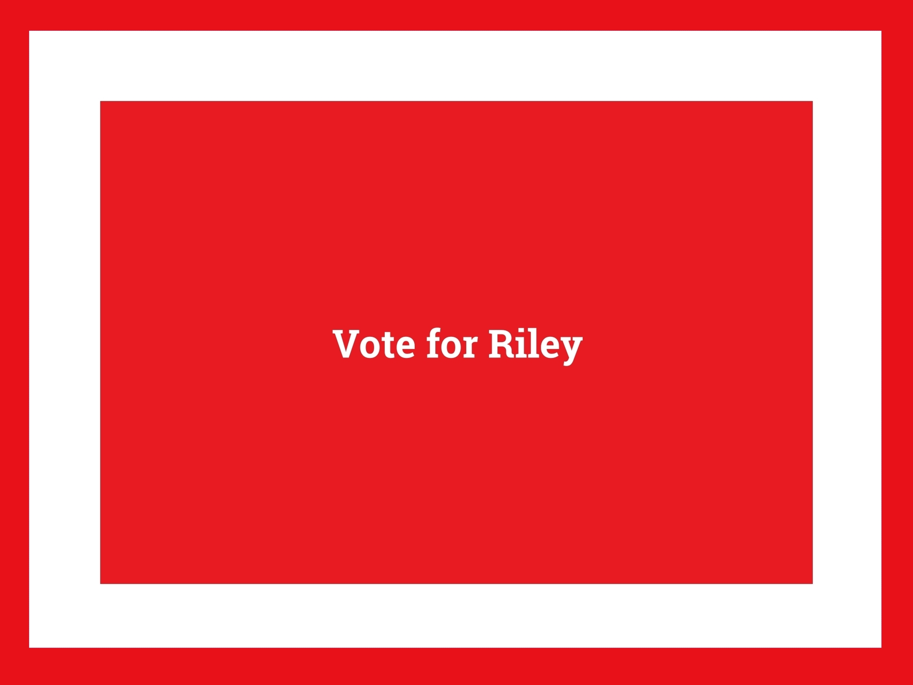
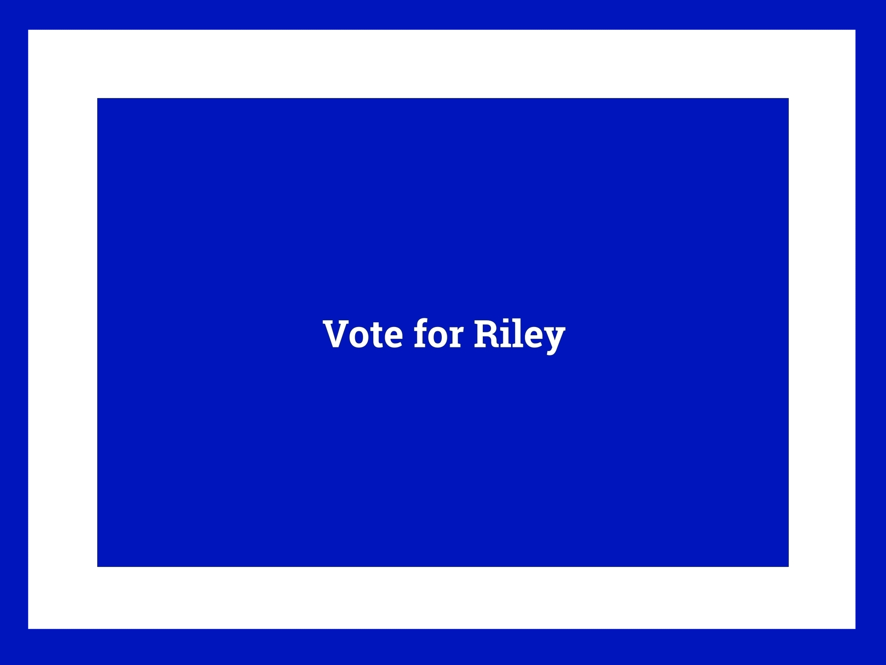
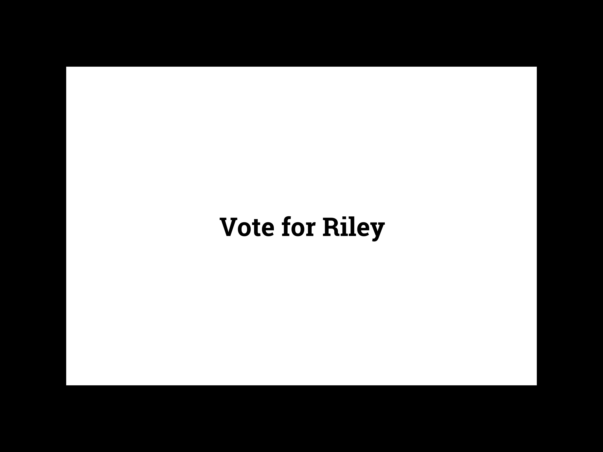
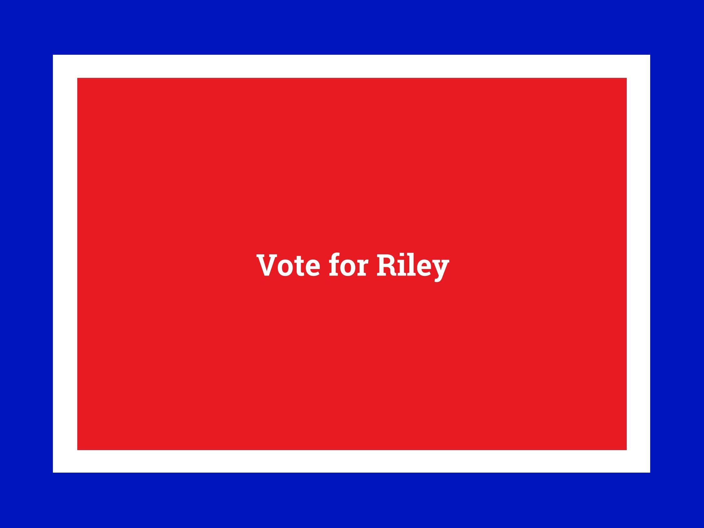
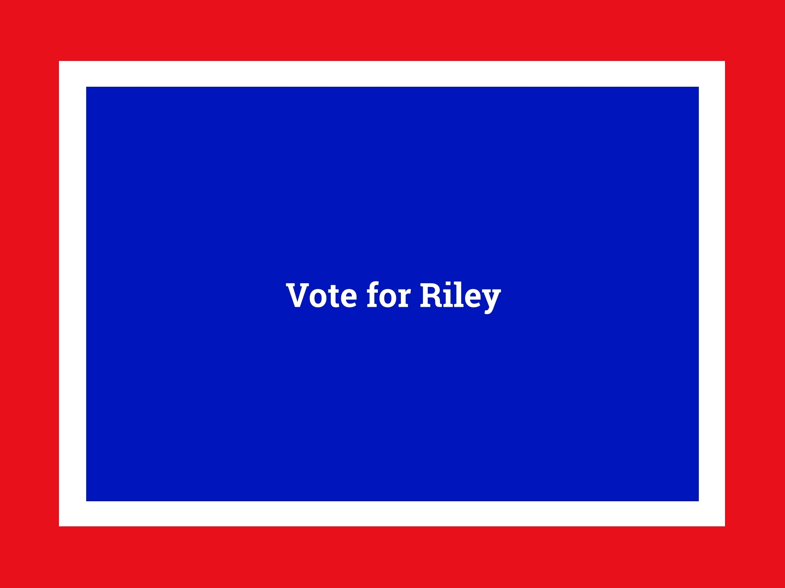

# Study 1 Stimuli

## Trial 1

{width=4in height=3in}

{width=4in height=3in}

{width=4in height=3in}



## Trial 2

{width=4in height=3in}

{width=4in height=3in}

{width=4in height=3in}



## Trial 3

{width=4in height=3in}

{width=4in height=3in}

{width=4in height=3in}



# Pre-test

::: {.cell}

:::

::: {.cell}

:::

::: {#tbl-pre-test-table .cell tbl-cap='Color on Yard Signs shape perceptions and vote intentions of candidate'}
::: {.cell-output-display}
\begin{table}
\centering
\begin{tabular}[t]{lcc}
\toprule
  & Party & Candidate evaluation\\
\midrule
Blue treatment & \num{-2.435} & \num{-0.020}\\
 & {}[\num{-2.923}, \num{-1.979}] & {}[\num{-0.524}, \num{0.515}]\\
Red treatment & \num{2.638} & \num{-0.086}\\
 & {}[\num{2.121}, \num{3.198}] & {}[\num{-0.613}, \num{0.437}]\\
Party ID &  & \num{-0.183}\\
 &  & {}[\num{-0.360}, \num{-0.005}]\\
Blue treatment $\times$ Party ID &  & \num{-0.162}\\
 &  & {}[\num{-0.401}, \num{0.078}]\\
Red treatment $\times$ Party ID &  & \num{0.637}\\
 &  & {}[\num{0.382}, \num{0.905}]\\
Threshold 1 & \num{-1.229} & \num{-1.929}\\
 & {}[\num{-1.551}, \num{-0.912}] & {}[\num{-2.353}, \num{-1.527}]\\
Thresholds &  & \\
Threshold 2 & \num{0.696} & \num{2.880}\\
 & {}[\num{0.396}, \num{0.994}] & {}[\num{2.384}, \num{3.405}]\\
\midrule
N & \num{520} & \num{463}\\
\bottomrule
\multicolumn{3}{l}{\rule{0pt}{1em}Data source: Pre-test experiment.}\\
\multicolumn{3}{l}{\rule{0pt}{1em}Median estimate from fitted model with 6 chains and 2000 iterations.}\\
\multicolumn{3}{l}{\rule{0pt}{1em}95-percent credible intervals in brackets.}\\
\end{tabular}
\end{table}
:::
:::
